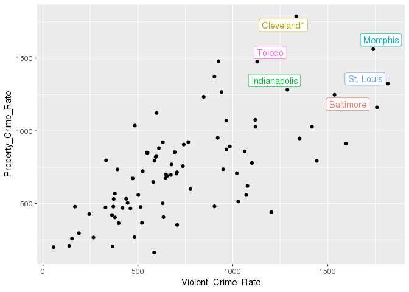
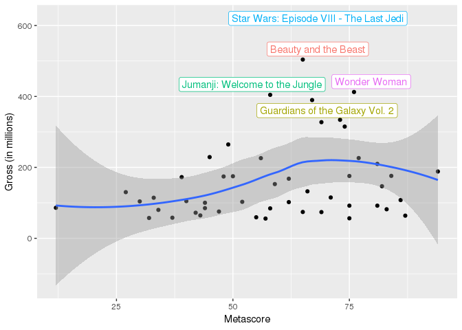
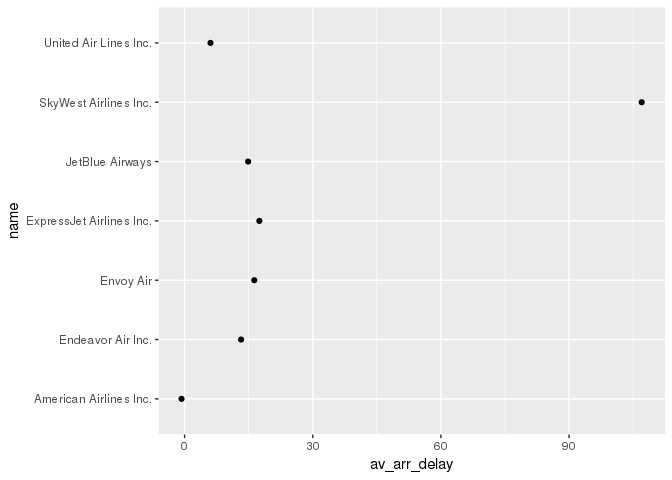
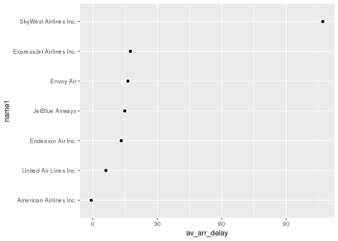
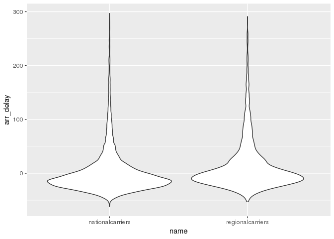

You should submit a knitted pdf file on Moodle, but be sure to show all
of your R code, in addition to your output, plots, and written
responses.

Web scraping
------------

1.  Read in the table of data found at
    <https://en.wikipedia.org/wiki/List_of_United_States_cities_by_crime_rate>
    and create a plot showing violent crime rate (total violent crime)
    vs. property crime rate (total property crime). Identify outlier
    cities (those with "extreme" values for `VCrate` and/or `PCrate`) by
    feeding a data set of outliers into `geom_label_repel()`.

Hints:

-   after reading in the table using `html_table()`, create a data frame
    with just the columns you want, using a command such as:
    `crimes3 <- as.data.frame(crimes2)[,c(LIST OF COLUMN NUMBERS)]`.
    Otherwise, R gets confused since it appears as if several columns
    all have the same column name.
-   then, turn `crimes3` into a tibble with `as.tibble(crimes3)` and do
    necessary tidying: get rid of unneeded rows, parse columns into
    proper format, etc.

<!-- -->

    crime <- read_html("https://en.wikipedia.org/wiki/List_of_United_States_cities_by_crime_rate")
    crimetable <- html_nodes(crime, css = "table") 
    crimedata <- html_table(crimetable, header = TRUE, fill = TRUE)[[2]]
    crimedata1 <- as.data.frame(crimedata)[,c(1,2,4,10)]
    crimedata2 <- as.tibble(crimedata1)

    crimedatatidy <- crimedata2 %>%
      rename(`Violent_Crime` = "Violent Crime",
             `Property_Crime` = "Property Crime") %>%
      mutate(Violent_Crime_Rate = parse_double(Violent_Crime),
             Property_Crime_Rate = parse_double(Property_Crime)) %>%
      select(State, City, Violent_Crime_Rate, Property_Crime_Rate)

    ## Warning: 1 parsing failure.
    ## row # A tibble: 1 x 4 col     row   col expected actual expected   <int> <int> <chr>    <chr>  actual 1     1    NA a double Total

    ## Warning: 1 parsing failure.
    ## row # A tibble: 1 x 4 col     row   col expected actual expected   <int> <int> <chr>    <chr>  actual 1     1    NA a double Total

    crimedatatidy1 <- crimedatatidy[-c(1), ] %>%
      arrange(State)

    crimedatatidy1

    ## # A tibble: 83 x 4
    ##    State      City        Violent_Crime_Rate Property_Crime_Rate
    ##    <chr>      <chr>                    <dbl>               <dbl>
    ##  1 Alabama    Mobile2                   611.                882 
    ##  2 Alaska     Anchorage                1071.                559.
    ##  3 Arizona    Chandler                  189.                297.
    ##  4 Arizona    Mesa                      419.                471.
    ##  5 Arizona    Phoenix                   594.                820.
    ##  6 Arizona    Tucson                    656.                692.
    ##  7 California Anaheim                   364.                422.
    ##  8 California Bakersfield               484.               1037.
    ##  9 California Chula Vista               266.                268.
    ## 10 California Fresno                    551.                850.
    ## # ... with 73 more rows

    outliercrime <- crimedatatidy1 %>%
      filter(Violent_Crime_Rate >= 1000, Property_Crime_Rate >= 1240)

    ggplot(data = crimedatatidy1,aes(x = Violent_Crime_Rate, y = Property_Crime_Rate)) +
      geom_point() +
      ggrepel::geom_label_repel(aes(label = City, colour = City), data = outliercrime, show.legend = FALSE)

1.  As we did in class, use the `rvest` package to pull off data from
    imdb's top grossing films released in 2017 at
    <https://www.imdb.com/search/title?year=2017&title_type=feature&sort=boxoffice_gross_us,desc>.
    Create a tibble that contains the title, gross, imdbscore, and
    metascore for the top 50 films. Then generate a scatterplot of one
    of the ratings vs. gross, labelling outliers as in Question 1 with
    the title of the movie.

<!-- -->

    top50 <- read_html("https://www.imdb.com/search/title?title_type=feature&year=2017-01-01,2017-12-31&sort=boxoffice_gross_us,desc")
    top50

    ## {xml_document}
    ## <html xmlns:og="http://ogp.me/ns#" xmlns:fb="http://www.facebook.com/2008/fbml">
    ## [1] <head>\n<meta http-equiv="Content-Type" content="text/html; charset= ...
    ## [2] <body id="styleguide-v2" class="fixed">\n\n            <img height=" ...

    title <- html_nodes(top50, ".lister-item-header a")
    title1 <- html_text(title)
    title1

    ##  [1] "Star Wars: Episode VIII - The Last Jedi"         
    ##  [2] "Beauty and the Beast"                            
    ##  [3] "Wonder Woman"                                    
    ##  [4] "Jumanji: Welcome to the Jungle"                  
    ##  [5] "Guardians of the Galaxy Vol. 2"                  
    ##  [6] "Spider-Man: Homecoming"                          
    ##  [7] "It"                                              
    ##  [8] "Thor: Ragnarok"                                  
    ##  [9] "Despicable Me 3"                                 
    ## [10] "Justice League"                                  
    ## [11] "Logan"                                           
    ## [12] "The Fate of the Furious"                         
    ## [13] "Coco"                                            
    ## [14] "Dunkirk"                                         
    ## [15] "Get Out"                                         
    ## [16] "The Lego Batman Movie"                           
    ## [17] "The Boss Baby"                                   
    ## [18] "The Greatest Showman"                            
    ## [19] "Pirates of the Caribbean: Dead Men Tell No Tales"
    ## [20] "Kong: Skull Island"                              
    ## [21] "Cars 3"                                          
    ## [22] "War for the Planet of the Apes"                  
    ## [23] "Wonder"                                          
    ## [24] "Transformers: The Last Knight"                   
    ## [25] "Girls Trip"                                      
    ## [26] "Fifty Shades Darker"                             
    ## [27] "Baby Driver"                                     
    ## [28] "Pitch Perfect 3"                                 
    ## [29] "Daddy's Home Two"                                
    ## [30] "Murder on the Orient Express"                    
    ## [31] "Annabelle: Creation"                             
    ## [32] "Kingsman: The Golden Circle"                     
    ## [33] "Blade Runner 2049"                               
    ## [34] "John Wick: Chapter 2"                            
    ## [35] "The Emoji Movie"                                 
    ## [36] "Power Rangers"                                   
    ## [37] "Ferdinand"                                       
    ## [38] "The Post"                                        
    ## [39] "The Mummy"                                       
    ## [40] "The Hitman's Bodyguard"                          
    ## [41] "Alien: Covenant"                                 
    ## [42] "Captain Underpants: The First Epic Movie"        
    ## [43] "A Bad Moms Christmas"                            
    ## [44] "A Dog's Purpose"                                 
    ## [45] "The Shape of Water"                              
    ## [46] "The Lego Ninjago Movie"                          
    ## [47] "Baywatch"                                        
    ## [48] "The Shack"                                       
    ## [49] "Darkest Hour"                                    
    ## [50] "Happy Death Day"

    gross <- html_nodes(top50, ".ghost~ .text-muted+ span")
    gross1 <- html_text(gross)
    gross2 <- parse_number(gross1)
    gross2

    ##  [1] 620.18 504.01 412.56 404.52 389.81 334.20 327.48 315.06 264.62 229.02
    ## [11] 226.28 226.01 209.73 188.37 176.04 175.75 175.00 174.34 172.56 168.05
    ## [21] 152.90 146.88 132.42 130.17 115.11 114.38 107.83 104.90 104.03 102.83
    ## [31] 102.09 100.23  92.05  92.03  86.09  85.07  84.41  81.90  80.10  75.47
    ## [41]  74.26  73.92  72.11  64.51  63.86  59.28  58.06  57.33  56.44  55.68

    metascore <-  html_nodes(top50, ".ratings-metascore")
    metascore1 <- html_text(metascore)
    metascore2 <- parse_number(metascore1)
    metascore2

    ##  [1] 85 65 76 58 67 73 69 74 49 45 77 56 81 94 84 75 50 48 39 62 59 82 66
    ## [24] 27 71 33 86 40 30 52 62 44 81 75 12 44 58 83 34 47 65 69 42 43 87 55
    ## [47] 37 32 75 57

    imdbscore <- html_nodes(top50, ".ratings-imdb-rating strong")  
    imdbscore1 <- parse_number(html_text(imdbscore))
    imdbscore1

    ##  [1] 7.2 7.2 7.5 7.0 7.7 7.5 7.4 7.9 6.3 6.5 8.1 6.7 8.4 7.9 7.7 7.3 6.3
    ## [18] 7.7 6.6 6.7 6.8 7.5 8.0 5.2 6.2 4.6 7.6 5.9 6.0 6.5 6.5 6.8 8.0 7.5
    ## [35] 3.2 6.0 6.7 7.2 5.5 6.9 6.4 6.2 5.5 7.0 7.4 6.0 5.6 6.3 7.4 6.5

    top50table <- tibble(title1, gross2, metascore2, imdbscore1)
    top50table %>%
      rename("Title" = title1, "Gross" = gross2, "Metascore" = metascore2, "Imdb Score" = imdbscore1)

    ## # A tibble: 50 x 4
    ##    Title                                   Gross Metascore `Imdb Score`
    ##    <chr>                                   <dbl>     <dbl>        <dbl>
    ##  1 Star Wars: Episode VIII - The Last Jedi  620.        85          7.2
    ##  2 Beauty and the Beast                     504.        65          7.2
    ##  3 Wonder Woman                             413.        76          7.5
    ##  4 Jumanji: Welcome to the Jungle           405.        58          7  
    ##  5 Guardians of the Galaxy Vol. 2           390.        67          7.7
    ##  6 Spider-Man: Homecoming                   334.        73          7.5
    ##  7 It                                       327.        69          7.4
    ##  8 Thor: Ragnarok                           315.        74          7.9
    ##  9 Despicable Me 3                          265.        49          6.3
    ## 10 Justice League                           229.        45          6.5
    ## # ... with 40 more rows

    outliermovie <- top50table %>%
      filter(gross2 >= 350)

    ggplot(data = top50table, aes(x = metascore2, y = gross2)) +
      geom_point() +
      geom_smooth() +
      ggrepel::geom_label_repel(aes(label = title1, colour = title1), data = outliermovie, show.legend = FALSE) +
      labs(x = "Metascore", y = "Gross (in millions)")

    ## `geom_smooth()` using method = 'loess' and formula 'y ~ x'

1.  5 points if you push your Rmd file with HW13 solutions along with
    the knitted pdf file to your MSCS264-HW13 repository in your GitHub
    account. So that I can check, make your repository private (good
    practice when doing HW), but add me (username = proback) as a
    collaborator under Settings &gt; Collaborators.

Done.

Factors
-------

Read Chapter 15 on factors and attempt the following problems:

1.  In the `nycflights13` data, just consider flights to O'Hare
    (dest=="ORD"), and summarize the mean arrival delay by carrier
    (actually use the entire name of the carrier after merging carrier
    names into `flights`). Then use `geom_point` to plot mean arrival
    delay vs. carrier - first without reordering carrier names, and
    second after reordering carrier names by mean arrival delay.

<!-- -->

    library(nycflights13)

    oharedelay <- flights %>%
      filter(dest == "ORD") %>%
      left_join(airlines, by = "carrier") %>%
      group_by(name) %>%
      summarise(av_arr_delay = mean(arr_delay, na.rm = TRUE))

    oharedelay

    ## # A tibble: 7 x 2
    ##   name                     av_arr_delay
    ##   <chr>                           <dbl>
    ## 1 American Airlines Inc.         -0.714
    ## 2 Endeavor Air Inc.              13.2  
    ## 3 Envoy Air                      16.3  
    ## 4 ExpressJet Airlines Inc.       17.5  
    ## 5 JetBlue Airways                14.9  
    ## 6 SkyWest Airlines Inc.         107    
    ## 7 United Air Lines Inc.           6.07

    ggplot(data = oharedelay, aes(x = av_arr_delay, y = name)) +
      geom_point()

    oharedelay %>%
      mutate(name1 = fct_reorder(name, av_arr_delay)) %>%
      ggplot(aes(x = av_arr_delay, y = name1)) +
      geom_point()

1.  Again considering only flights to O'Hare, create a new factor
    variable which differentiates national carriers (American and
    United) from regional carriers (all others which fly to O'Hare).
    Then create a violin plot comparing arrival delays for all flights
    to O'Hare from those two groups (you might want to exclude arrival
    delays over a certain level).

<!-- -->

    flights %>%
       filter(dest == "ORD") %>%
      left_join(airlines, by = "carrier") %>%
      count(name)

    ## # A tibble: 7 x 2
    ##   name                         n
    ##   <chr>                    <int>
    ## 1 American Airlines Inc.    6059
    ## 2 Endeavor Air Inc.         1056
    ## 3 Envoy Air                 2276
    ## 4 ExpressJet Airlines Inc.     2
    ## 5 JetBlue Airways            905
    ## 6 SkyWest Airlines Inc.        1
    ## 7 United Air Lines Inc.     6984

    oharedelay1 <- flights %>%
      filter(dest == "ORD") %>%
      left_join(airlines, by = "carrier") %>%
      mutate(name = fct_collapse(name,
                                 nationalcarriers = c("American Airlines Inc.", "United Air Lines Inc."),
                                 regionalcarriers = c("Endeavor Air Inc.", "Envoy Air", "ExpressJet Airlines Inc.",
                                                      "JetBlue Airways", "SkyWest Airlines Inc."))) %>%
      select(name, arr_delay)

    oharedelay2 <- oharedelay1 %>%
      filter(arr_delay <= 300) 

    ggplot(data = oharedelay2, aes(x = name, y = arr_delay)) +
      geom_violin()

